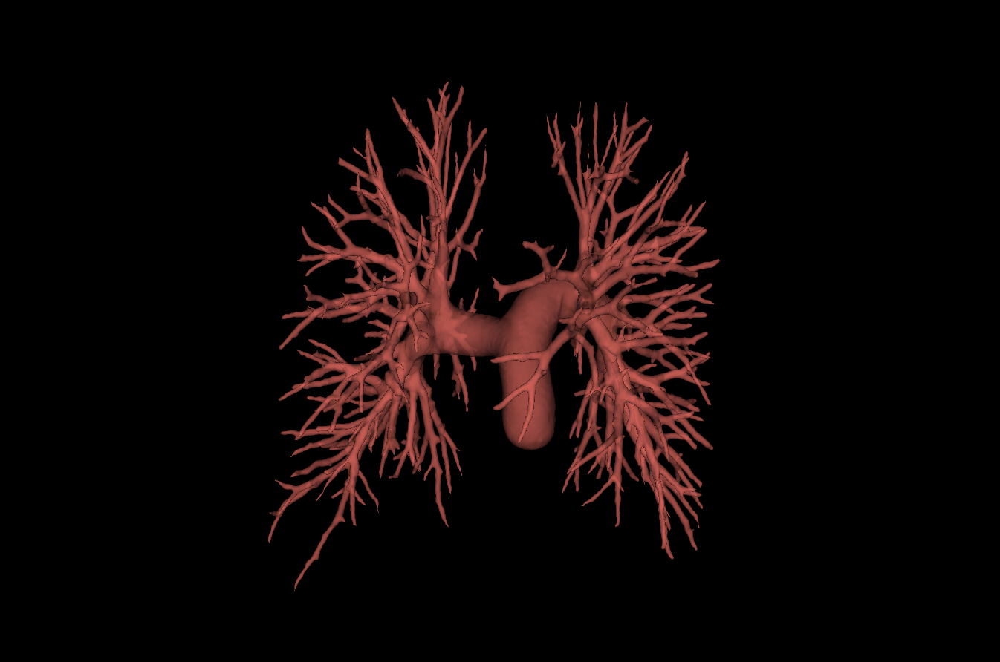

This code runs in Python within the 3D Slicer environment, accessed via Jupyter Notebook using the SlicerJupyter extension.

### Setup
1. Install 3D Slicer and the above extensions via the Extension Manager.
2. Launch a Jupyter server from within Slicer (via SlicerJupyter).
3. Connect to the Slicer kernel in Jupyter Notebook — **do not use a standard Python kernel**.
4. Clone this repository and open `extract_trim_network.ipynb`.

## Usage

1. Load your segmented vascular label map (e.g. `example_patree.nii.gz`) into the Slicer scene.
2. Run VMTK network extraction to generate a centreline/network model.
3. Open and run `extract_trim_network.ipynb`, specifying:
   - Segmented vessel file_ename (`example_patree.nii.gz`)
   - The maximum number of bifurcations (`N`)
4. The trimmed network is saved back into the Slicer scene and/or exported.

## Example

<table>
  <tr>
    <td></td>
    <td></td>
  </tr>
  <tr>
    <td></td>
    <td></td>
  </tr>
</table>
